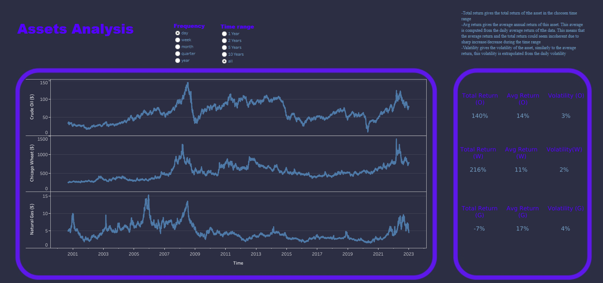
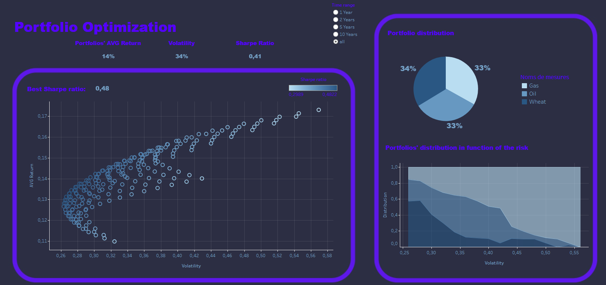

# Portfolio_Optimization

## The Mission:

The goal of this project is to create a paid-tool for clients who want to manage their own investment accounts.

The project leads gaves me a few days to work on a solution in which the user can choose a list of stocks, a time range and frequency (days, months, years) and from these inputs calculate important metrics and dispay them on a Tableau Dashboard. Those metrics are the following:

* The optimal portfolio using the most well-known technique, the mean-variance optimization method.
* the efficient-frontier as well the historical return, volatility and Sharpe ratio

## Execution Steps:

* __1.__ Get familiar with the finance vocabulary
* __2.__ Collect the required data
* __3.__ Compute the required informations
* __4.__ Build the Dashboards

### 1. Finance Vocabulary
 The first step of the project was to understand what was required from me. In the file ["Vocabulary"](Vocabulary.ipynb) you will find an explaination of the different data I displayed on my dashboard.

### 2. Data Collection
The next step is to collect the datas we will analyse. I used [yahoo finance](https://pypi.org/project/yfinance/) to get datas on the price of __wheat__, __oil__ and __natural gas__. You can find the code use to collect and clean those datas on the file [data collection](./Data/data_collection.ipynb)

### 3. Computation with python
The third step is to compute the informations I want to display on my dashboards with python. You can find those codes in the file [Portfolios](./Data/Portfolios.ipynb). In this part, for each time range (all, 10 years, 5 years, 2 years, 1 year):
* Create the portfolios' distribution. One column for each assets with its weight in the portfolio.
* For all those portfolios, the desired datas are computed (Total Return, Avg annual return, volatility, sharpe ratio, ...).
* Save those new DataFrames into csv's.

### 4. Dashboards
The lat step of the project is to build dashboards to show and analyse those data. You can find those dashboards on the following link: [Dashboards](https://public.tableau.com/views/Portfolio_optimization/Story1?:language=fr-FR&publish=yes&:display_count=n&:origin=viz_share_link) 

You will find there 2 dashboards, the first one (Assets Analysis) enables to have an overview of the characteristics of the 3 assets. 

The second one (Portfolios analysis), will enables you to analyse the efficiency (return, volatility, sharpe ratio,...) of different portfolios. This last dashboard has some interactivity, it means that you can click on the efficient frontier/ efficient frontier distribution plots to filter the data of the dashboards and so have informations about the desired portfolio(s).

## Limits of the project
In order to improve this project here is some possibilities:

* The dashboard updates automatically when new informations are added into a database.
* The user can choose a frequency and a complete time range (start and end) to analyse.
* The user can choose which assets he wants to analyse.
* Add more insights(sortino ratio, mean average based on the frequency, ...)

These improvements could be added using Tableau (not Tableau public). Indeed, Tableau enables connection to databases and enables R/Python computation.

__contributor:__ _[Jumpertz Sacha](www.linkedin.com/in/jumpertz-sacha)_
